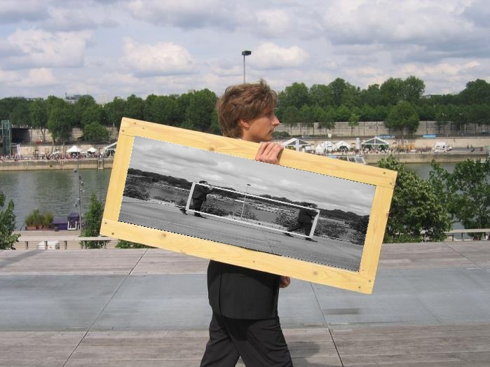
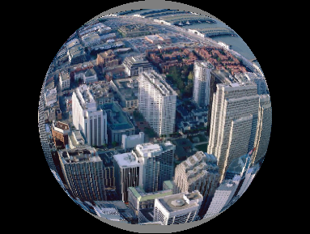
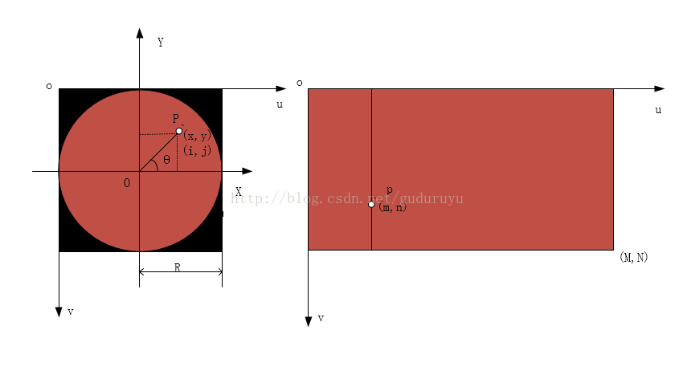
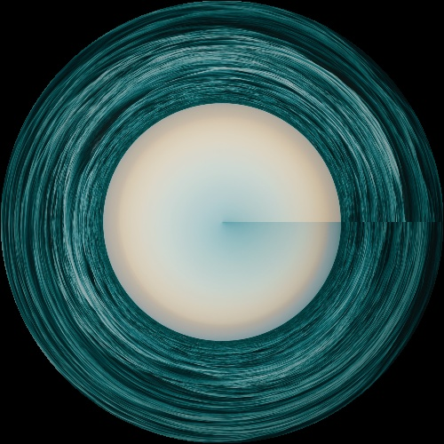

# Image Warping

> 张祎维 计71 2017013640

## 1. 仿射变形 Affine warping

#### 设计思路及关键代码

此题即将一个图片做仿射变形，将`Source`图片仿射到`Target`图片的方框内部，最后生成结果图`Result`，对于不能对齐的点，此处选择的是`Inverse warping`的处理模式。  

由课上老师所讲，此处的变形即是一个线性变换，$Ax=b$，其中$x$表示`Source`内的坐标，$b$表示`Result`内的坐标，首先即求出变换矩阵$A$，由于这是一个仿射变换，其自由度为6，只有6个值不确定，选择变换前后三个对应点的坐标即可将$A$解出。如下：  

$$
\begin{vmatrix}
	a&b&c\\
	d&e&f\\
	0&0&1\\
\end{vmatrix}
 \times
\begin{vmatrix}
	x_1&x_2&x_3\\
	y_1&y_2&y_3\\
	1&1&1\\
\end{vmatrix}
=
\begin{vmatrix}
	x_1'&x_2'&x_3'\\
	y_1'&y_2'&y_3'\\
	1&1&1
\end{vmatrix}
\tag{1}
$$

解出$a,b,c,d,e,f$值即可，此处调用了`Eigen`库中的相应函数。  

之后则由$b$解出对应的$x$,即由在`Result`中的坐标解出对应的`Source`中的坐标即可，如下：  

```c++
Eigen::Vector3f vecX = A.colPivHouseholderQr().solve(vecB);
```

之后解出的结果若是位于`Source`中，则用`Source`中的`bgr`值填充（解出的结果位于`Source`中即意味着当前点在`Result`的方框内部），否则即用`Target`中相应点填充即可。如下：  

```c++
if (0 <= x && x < source.rows && 0 <= y && y < source.cols)
	result.at<Vec3b>(i,j) = interpolate(source, x, floor(x), ceil(x), y, floor(y), ceil(y));
else
	result.at<Vec3b>(i,j) = target.at<Vec3b>(i,j);
```

另对于不能对齐的点，此处选择的是`Inverse warping`的处理模式，将点进行双线性插值计算（不过感觉并没有比直接去单个邻近点效果好..）。插值函数代码如下：  

```c++
// xf = floor(x), xc = ceil(x), yf = floor(y), yc = ceil(y)
if (xf == xc && yf == yc)
	res = src.at<Vec3b>(xf, yf);
else if (xf == xc)
	res = src.at<Vec3b>(xf, yf) * (yc-y) + src.at<Vec3b>(xf, yc) * (y-yf);
else if (yf == yc)
	res = src.at<Vec3b>(xf, yf) * (xc-x) + src.at<Vec3b>(xc, yf) * (x-xf);
else {
	Vec3f inter1 = src.at<Vec3b>(xf, yf) * (yc-y) + src.at<Vec3b>(xf, yc) * (y-yf);
	Vec3f inter2 = src.at<Vec3b>(xc, yf) * (yc-y) + src.at<Vec3b>(xc, yc) * (y-yf);
	res = inter1 * (xc-x) + inter2 * (x-xf);
}
```

#### 结果图



## 2. 球体变形 Sphere warping

#### 设计思路及关键代码

设计思路即如课上老师所讲，求出其对应的$\rho_0,d_0,\rho,\theta,\phi,d,r_{in}(x),r_{out}(y)$即可。对应计算公式在课件上，此处不表...另对于不能对齐的点，此处选择的也是`Inverse warping`的处理模式，不过选择的是直接选择临近点填充，并且对于圆内没有对应点的部分，统一填充为了灰色。

关键填充部分代码如下：  

```c++
if (-in.rows/2.0 <= x && x <= in.rows/2.0 && -in.cols/2.0 <= y && y <= in.cols/2.0)
	out.at<Vec3b>(i+out.rows/2, j+out.cols/2) = in.at<Vec3b>((int)round(x+in.rows/2.0), (int)round(y+in.cols/2.0));
else
	out.at<Vec3b>(i+out.rows/2, j+out.cols/2) = Vec3b(127, 127, 127);
```

#### 结果图



## 3. 极坐标变形 Polar coordinate warping

#### 设计思路及关键代码

此变形即将一个图片从其直角坐标形式变换为其极坐标形式，对于不能对齐的点，此处选择的是`Inverse warping`的处理模式。思路如下：



如上图，要将位于直角坐标图中的一个点$p$映射到其极坐标中$P$。在极坐标中，点$P$的图片中的坐标$(x,y)$与其在以$O$为圆点的坐标系中的对应转换关系为：

$$
\left\{\begin{array}{cc} 
		x=j-R\\ 
		y=R-i
\end{array}\right.
\tag{2}
$$

与点$p$在直角坐标系中对应的转换关系为：

$$
\left\{\begin{array}{cc} 
		m=r\times\delta_r\\ 
		y=\theta\div\delta_t
\end{array}\right.
\tag{3}
$$

其中

$$
\left\{\begin{array}{cc} 
		r=\sqrt{x^2+y^2}\\ 
		\theta=\arctan(\frac{y}{x}) \\
		\delta_r=\frac{image.height}{R} \\
		\delta_t=\frac{2\pi}{image.width}
\end{array}\right.
\tag{4}
$$

之后对于圆中的部分进行填充，对于不能对齐的点，使用`Inverse warping`处理模式，将点进行双线性插值计算，插值函数见上。并且此处预计到可能有的点转换回去之后其不位于原图中，则将点的`floor(x),ceil(x),floor(y),ceil(y)`值进行边界处理，如下：

```c++
int xf = floor(cx) > 0 ? (int)floor(cx) : 0;
int xc = ceil(cx) < height ? (int)ceil(cx) : (height-1);
int yf = floor(cy) > 0 ? (int)floor(cy) : 0;
int yc = ceil(cy) < width ? (int)ceil(cy) : (width-1);
```

最后进行填充即可，如下：

```c++
out.at<Vec3b>(i, j) = interpolate(in, cx, xf, xc, cy, yf, yc);
```

#### 实验结果

##### 第一组原图


##### 第一组结果图


##### 第二组原图


##### 第二组结果图



